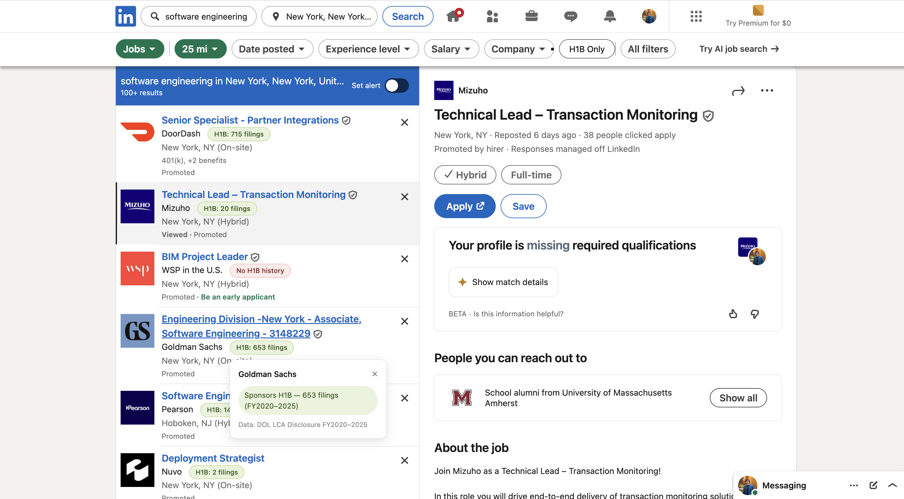

# VisaTrack

**See which companies sponsor H-1B visas — right on LinkedIn, before you apply.**

VisaTrack is a Chrome extension that overlays U.S. Department of Labor H-1B sponsorship data directly onto LinkedIn job listings. For international students and workers who need visa sponsorship, it turns hours of manual company research into a glance.



---

## The Problem

If you're on an F-1 visa, every LinkedIn job search is a minefield. There's no way to tell which companies actually sponsor H-1B visas without researching each one by hand. You waste hours applying to roles that auto-reject you the moment you check "yes" on sponsorship.

VisaTrack fixes that by showing real sponsorship data on every job card.

## What It Does

- **Color-coded badges** on LinkedIn job listings:
  - 🟢 **Green** — company has sponsored H-1B visas (shows total filing count)
  - 🔴 **Red** — no H-1B filing history found in the dataset
- **Click any badge** for a detail popup with the company's filing history and data source
- **"H1B Only" filter** — one toggle to hide every company that doesn't sponsor
- Works across LinkedIn's job search surfaces

## Data

VisaTrack is powered by public **Labor Condition Application (LCA)** disclosure data from the U.S. Department of Labor, Office of Foreign Labor Certification.

- Covers fiscal years **2020–2025**
- **70,000+ unique employers**
- Only counts **certified H-1B** filings

The dataset is processed locally from the DOL's raw Excel files into a compact lookup table the extension reads instantly — no external API calls, no tracking, everything runs in your browser.

## How It's Built

| Piece | Tech |
|-------|------|
| Extension | JavaScript, Chrome Manifest V3 |
| Page integration | LinkedIn DOM injection + MutationObserver (handles LinkedIn's single-page-app behavior) |
| Data pipeline | Python + pandas (`build_h1b_data.py`) |
| Storage | Local JSON, `chrome.storage` for filter state |

## Rebuilding the Dataset

To regenerate the H-1B data (e.g. to add a newer fiscal year):

1. Download the annual **LCA Disclosure Data** Excel files from the [DOL OFLC Performance Data page](https://www.dol.gov/agencies/eta/foreign-labor/performance) (use the Q4 file for each year — it's cumulative for the whole year).
2. Place them in the project folder.
3. Run:
   ```bash
   pip install pandas openpyxl
   python3 build_h1b_data.py
   ```
4. This outputs a fresh `h1b_data.json` that the extension picks up automatically.

> Note: the raw DOL Excel files and the generated `h1b_data.json` are excluded from version control (they're large). The build script lets anyone regenerate them.

## Install (Developer Mode)

1. Clone this repo
2. Build the dataset (see above) so `h1b_data.json` exists
3. Go to `chrome://extensions`, enable **Developer mode**
4. Click **Load unpacked** and select the project folder
5. Open LinkedIn Jobs and start searching

## Why I Built This

I'm an international student. I built VisaTrack because I needed it — the problem was mine, the user was me, and I shipped something that solves it end to end.

---

*Data source: U.S. Department of Labor, Office of Foreign Labor Certification — LCA Disclosure Data (FY2020–FY2025). VisaTrack is an independent project and is not affiliated with LinkedIn or the Department of Labor.*
